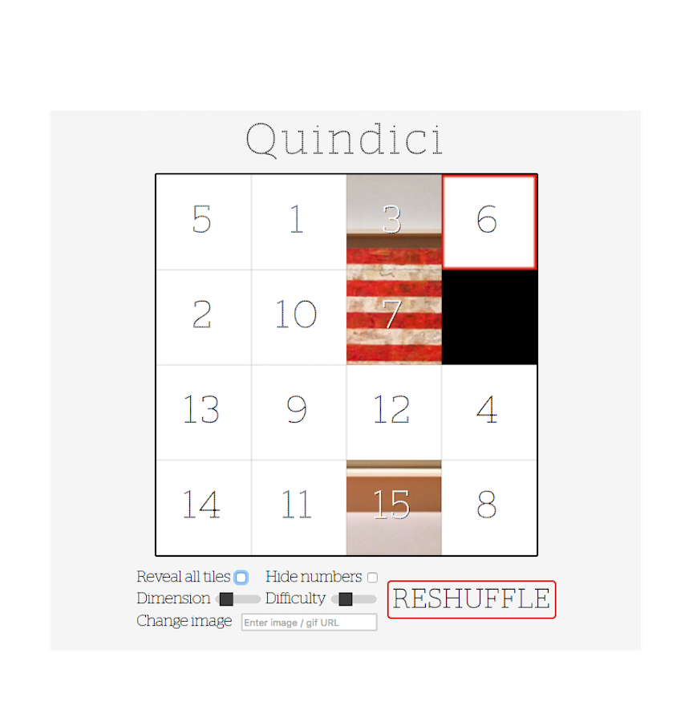
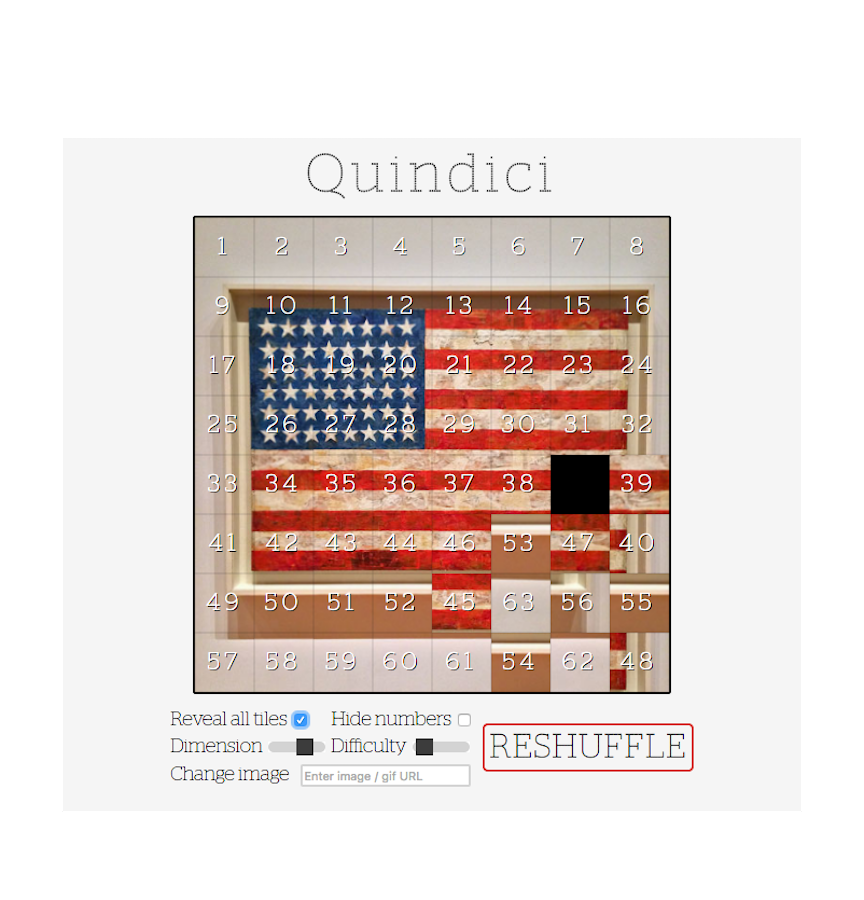
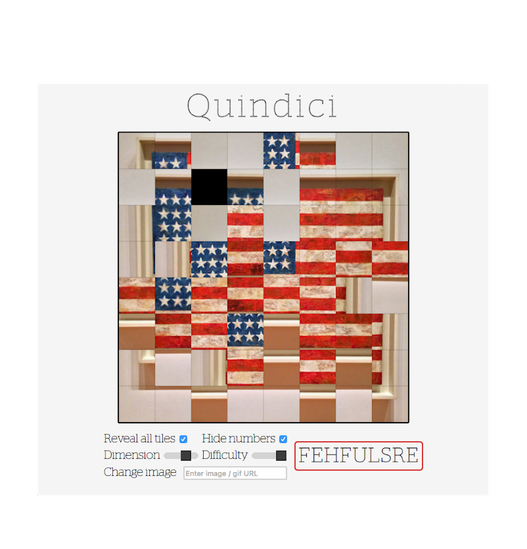

# Quindici

[Play the game.](https://francis-m-kim.github.io/Quindici/)

This is an update of the classic Game of 15 puzzle, using an image or GIF as a background. The aim of the game is to order the numbered image fragments from lowest to highest (left to right, top to bottom) with a blank space in the lower right corner. In other words, the game is won when the image is in order again.

Tiles that are not in the correct position are given a white square by default, but this can be changed with the controls below the board. The numbers can also be hidden. The dimensions of the board can be reset to anything between a 3 x 3 grid and a well-nigh impossible 10 x 10. To change the image or GIF background, simply paste an image URL in the text input field and click reshuffle.

According to [Wikipedia](https://en.wikipedia.org/wiki/15_puzzle#Solvability), half of all possible starting positions are impossible to resolve. To work around this, I created a simple AI to play the game backwards from the solved state. This of course ensures that every instance of the game is solvable. The function is called `createWinnableGame`, which takes an argument of the number of `movesFromWinning` and is controlled by the difficulty slider.

###A couple clips of the game in action:

The game is more compelling with video. Give it a try!
